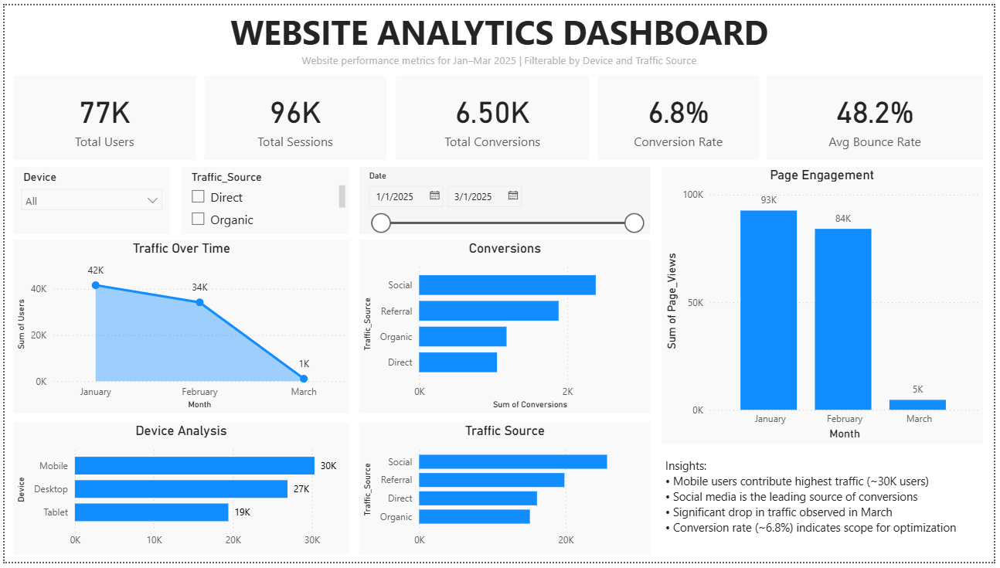

# 📊 Website Analytics Dashboard (Power BI)

## 🔹 Project Overview

This project presents a Power BI dashboard analyzing website performance, user behavior, and conversion trends.

The dashboard provides insights into:

* User traffic patterns over time
* Conversion performance across channels
* Device-wise user distribution
* Page engagement trends

---

## 📌 Key Metrics

* Total Users: 77K
* Total Sessions: 96K
* Total Conversions: 6.5K
* Conversion Rate: 6.8%
* Bounce Rate: 48.2%

---

## 📊 Dashboard Preview

---

## 🔍 Key Insights

* Mobile users contribute the highest traffic (~30K users)
* Social media is the leading source of conversions
* Significant drop in traffic observed in March
* Conversion rate (~6.8%) indicates scope for optimization

---

## 🛠️ Tools Used

* Power BI
* Excel / CSV Dataset
* Data Visualization Techniques

---

## 📁 Files in Repository

* `dashboard.pbix` → Power BI dashboard file
* `dataset.csv` → Dataset used
* `dashboard.png` → Dashboard preview

---

## 🚀 How to Use

1. Download the `.pbix` file
2. Open in Power BI Desktop
3. Interact with slicers and visuals

---

## 📌 Author

Harshitha Adicherla

